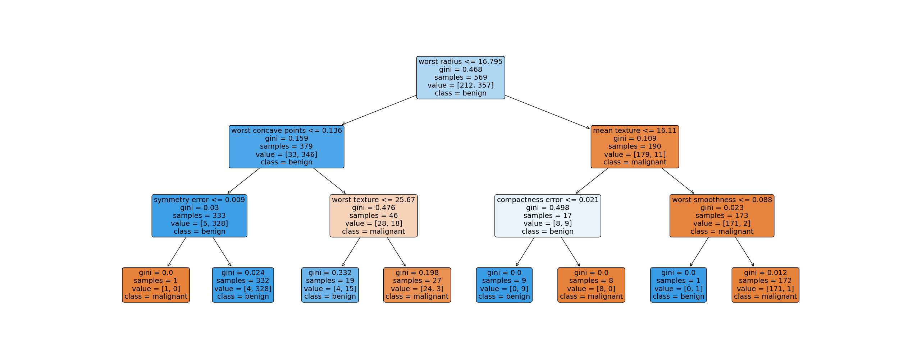

## Overview
This repository was made for an assignment regarding Decision Tree and Naive Bayes Theorem.

### Decision Tree
Here are the instruction to run the Decision Tree program : 
1. Make sure that you have sklearn version >=0.21 installed for `plot_tree` to work.
    ```python
    import sklearn
    print(sklearn.__version__)
    ```
2. Install python package, Matplotlib
3. Create a `figures` directory if it is not existed.
3. Next run the python file, and you will see a `.png` image in the `figures` directory.
    

This tree was generated using the `Breast Cancer` data set in `scikit-learn` package.

### Naive Bayes
How to run :
1. To run this program first you need to create a directory called `data` and download the `golf.csv` then save in the directory.
2. After that, you can run the program and see the result being printed in the terminal : 
    ```
       Outlook  Temp  Humidity  Windy Play Golf prediction
    2        2    83        78  False       Yes         No
    8        1    69        70  False       Yes         No
    4        3    68        80  False       Yes        Yes
    
    Naive Bayes Accuracy :  0.3333333333333333
    ```

## Reference
1. [Decision Tree Visualization](https://towardsdatascience.com/how-to-visualize-a-decision-tree-in-5-steps-19781b28ffe2)
2. [Naive Bayes](https://www.lewisgavin.co.uk/Naive-Bayes-Golf/)